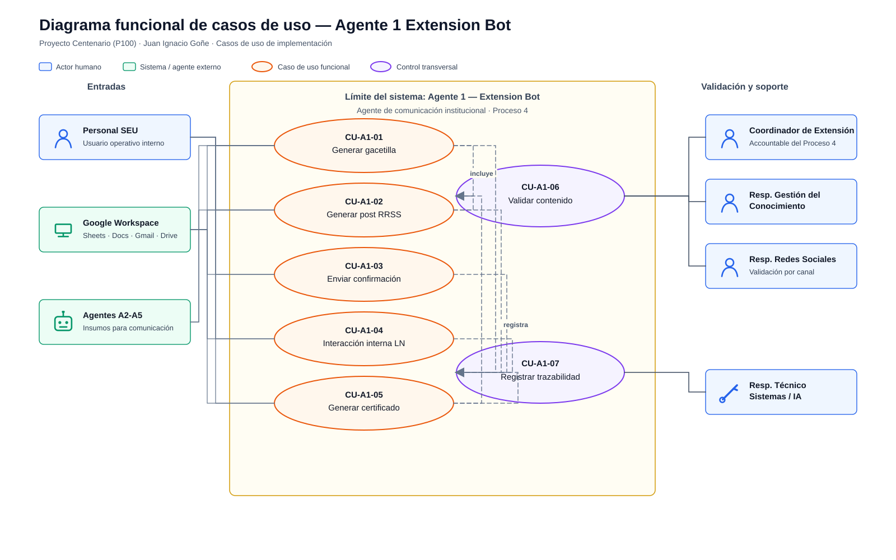
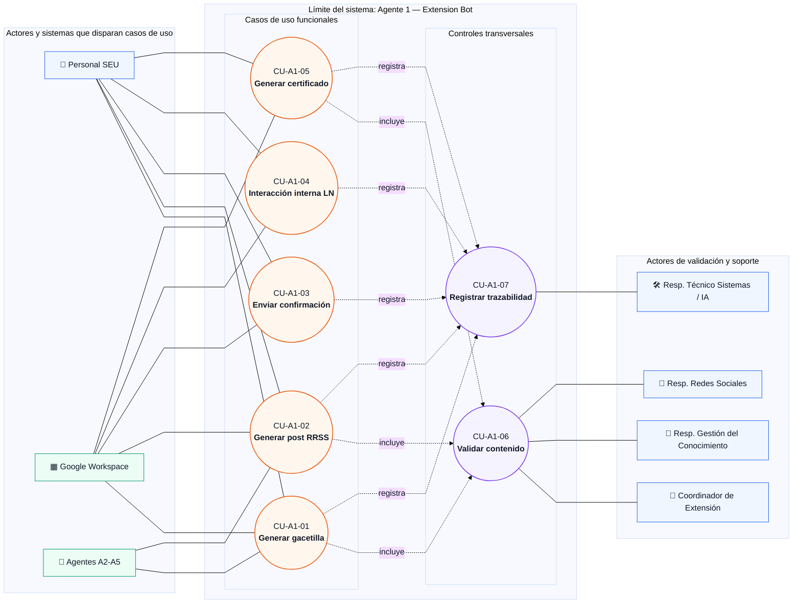

# Casos de uso — Agente 1 Extension Bot

**Proyecto:** Proyecto Centenario (P100) — Agente 1, Extension Bot  
**Autor del PPS:** Juan Ignacio Goñe  
**Artefacto:** documento de casos de uso para implementación  
**Estado:** borrador técnico trazable  
**Última actualización:** 2026-05-17

## 1. Propósito del documento

Este documento especifica los casos de uso de implementación del Agente 1 — Extension Bot, agente de comunicación institucional de la Secretaría de Extensión Universitaria. Su objetivo es transformar el backlog funcional vigente en escenarios verificables de interacción entre usuarios, sistemas institucionales y el agente, manteniendo trazabilidad con proceso BPM, historia de usuario, Definition of Done, evidencia esperada y responsable institucional.

El documento no reemplaza al anteproyecto ni a la documentación oficial del Proyecto Centenario. Funciona como artefacto técnico de análisis para orientar diseño, implementación, pruebas y validación con usuarios de la Secretaría.

## 2. Fuentes consultadas

- `CLAUDE.md`
- `.claude/persistence.md`
- `Agentes/extension_bot_experto.md`
- `Agentes/documentacion_sistemas_experto.md`
- `Agentes/arquitectura_multiagente_experto.md`
- `Contenido/Definicion/arquitectura-multiagente.md`
- `Agentes/evaluador_cicerchia.md`
- `Contenido/Definicion/criterios-evaluacion-cicerchia.md`
- `Contenido/bible/README.md`
- `Contenido/bible/Procesos y Agentes.md`
- `Contenido/Campus/INDEX.md`
- `Contenido/Campus/DSI1/_md/unidad-i.md`
- `Contenido/Campus/DSI1/_md/unidad-iii-ii.md`
- `Documentos/Anteproyecto/Anteproyecto-PPS-Juan-Ignacio-Gone.tex`

## 3. Supuestos y límites de alcance

### 3.1 Supuestos usados

1. El Agente 1 se ubica principalmente en el Proceso 4 — Comunicación y Difusión Institucional.
2. El MVP del Semestre 1 implementa HU-010 y HU-011.
3. El Semestre 2 incorpora HU-012, HU-013 y HU-014.
4. Google Workspace es la plataforma institucional base: Sheets, Docs, Drive, Gmail, Forms y Apps Script.
5. Los contenidos oficiales generados por IA quedan como borrador o pendiente de aprobación hasta recibir validación humana.
6. Las evidencias de validación deben quedar registradas mediante logs, documentos generados, checklist, capturas o registros de envío, según corresponda.
7. Los campos exactos de las planillas, plantillas institucionales finales y usuarios nominales de validación quedan pendientes de confirmación con la Secretaría.

### 3.2 Exclusiones

El Agente 1 no realiza scraping, analítica de redes sociales, dashboards, atención masiva al público general, publicación oficial sin revisión humana ni integración con sistemas externos complejos no definidos. Puede recibir insumos de A2, A3, A4 y A5, pero no orquesta el sistema multiagente.

## 4. Criterio metodológico

Un caso de uso describe una unidad coherente de funcionalidad visible para un actor externo al sistema. En este documento se modela qué debe hacer el Agente 1 desde la perspectiva de sus usuarios y sistemas vinculados, sin describir diseño interno, clases, prompts específicos ni implementación de código.

Cada caso de uso incluye:

- actor primario;
- actores secundarios o sistemas externos;
- precondiciones;
- disparador;
- flujo principal;
- flujos alternativos o excepciones;
- postcondiciones;
- criterios de aceptación y DoD;
- evidencia esperada;
- responsable de validación.

## 5. Alcance funcional consolidado

| ID | Historia | Prioridad | Semestre | TRL objetivo | Caso de uso asociado |
|---|---|---:|---|---|---|
| HU-010 | Generar automáticamente gacetillas institucionales | P0 | S1 | TRL 3 | CU-A1-01 |
| HU-011 | Generar posts para redes sociales | P0 | S1 | TRL 3 | CU-A1-02 |
| HU-012 | Enviar confirmaciones automáticas de inscripción | P1 | S2 | TRL 4 | CU-A1-03 |
| HU-013 | Interactuar con el agente en lenguaje natural para uso interno | P1 | S2 | TRL 4 | CU-A1-04 |
| HU-014 | Generar certificados automáticos con validación humana | P2 | S2 | TRL 4 | CU-A1-05 |

Los casos CU-A1-06 y CU-A1-07 son transversales: validación humana y registro de trazabilidad. No agregan alcance funcional nuevo; formalizan controles obligatorios para cerrar las historias anteriores.

## 6. Actores

| Actor | Tipo | Descripción | Responsabilidad principal |
|---|---|---|---|
| Personal de Secretaría de Extensión | Humano interno | Usuario operativo del agente | Cargar datos, solicitar contenidos, revisar resultados operativos |
| Coordinador de Extensión | Humano interno | Accountable del Proceso 4 | Aprobar pertinencia y utilidad de contenidos |
| Responsable de Gestión del Conocimiento de Extensión | Humano interno | Responsable funcional del contenido | Validar coherencia, exactitud, tono institucional y reutilización |
| Responsable de Redes Sociales | Humano interno | Responsable de canal de difusión | Validar adecuación de posts por canal |
| Coordinador o docente responsable de actividad | Humano interno | Proveedor de datos de actividad | Confirmar datos fuente de actividades, cursos o eventos |
| Responsable Técnico de Sistemas / IA | Humano técnico | Soporte de automatización y trazabilidad | Mantener integración, logs, permisos y ejecución técnica |
| Google Workspace | Sistema externo institucional | Sheets, Docs, Drive, Gmail, Forms, Apps Script | Entrada, salida, almacenamiento, triggers y comunicación |
| Agentes A2-A5 | Sistemas del P100 | Fuentes de insumos para comunicación | Aportar contenido histórico, eventos, respuestas complejas o texto enriquecido |
| Destinatarios externos | Público destinatario | Comunidad FIE, egresados, autoridades, patrocinadores o asistentes | Recibir comunicaciones ya validadas; no son usuarios directos del Agente 1 |

## 7. Diagrama funcional de casos de uso

Leyenda: cajas azules = actores humanos; cajas verdes = sistemas o agentes externos; óvalos naranjas = casos de uso funcionales; óvalos violetas = controles transversales obligatorios.

Versión recomendada para insertar en documentos: `diagrama-casos-uso-agente-1.svg` o `diagrama-casos-uso-agente-1.png`.

Fuente Mermaid editable:

## 8. Casos de uso detallados

### CU-A1-01 — Generar gacetilla institucional

| Campo | Descripción |
|---|---|
| Historia vinculada | HU-010 |
| Prioridad | P0 |
| Semestre / TRL | S1 / TRL 3 |
| Proceso BPM | P4 — Comunicación y Difusión Institucional |
| Actor primario | Personal de Secretaría de Extensión |
| Actores secundarios | Coordinador de Extensión, Responsable de Gestión del Conocimiento, Google Sheets, Google Docs, Google Drive |
| Responsable de validación | Coordinador de Extensión; Responsable de Gestión del Conocimiento |
| Objetivo | Generar un borrador de gacetilla institucional a partir de datos estructurados de una actividad. |

**Precondiciones**

- Existe una planilla Google Sheets con los datos mínimos de la actividad.
- La plantilla institucional de gacetilla está definida o marcada como pendiente de confirmación.
- El usuario tiene permisos para leer la planilla y generar el documento de salida.
- HU-001 y HU-002, o sus equivalentes mínimos, están disponibles para estructura Drive/Sheets y automatización base.

**Disparador**

El usuario registra o selecciona una actividad en Google Sheets y solicita la generación de gacetilla, o un trigger habilitado detecta una fila lista para procesar.

**Flujo principal**

1. El usuario carga o confirma los datos de la actividad en la planilla.
2. El sistema valida que los campos requeridos estén completos.
3. Apps Script o el backend envía los datos al Agente 1.
4. El Agente 1 genera un borrador de gacetilla con tono institucional.
5. El sistema crea un documento Google Docs usando la plantilla definida.
6. El documento queda en estado borrador o pendiente de validación.
7. El Responsable de Gestión del Conocimiento revisa coherencia, exactitud y tono.
8. El Coordinador de Extensión aprueba, observa o rechaza el contenido.
9. El sistema registra estado, usuario validador, fecha y vínculo al documento.

**Flujos alternativos y excepciones**

- A1. Faltan datos obligatorios: el sistema marca la fila como incompleta y solicita corrección.
- A2. La plantilla no está disponible: el sistema genera una salida provisional solo si está autorizado para pruebas; para uso oficial queda bloqueado.
- A3. El texto contiene información dudosa o no verificable: el validador rechaza el borrador y solicita regeneración o edición manual.
- A4. Falla la creación del Google Doc: el sistema registra error técnico y conserva la solicitud pendiente.

**Postcondiciones**

- Existe un Google Docs de gacetilla generado como borrador.
- La validación humana queda registrada.
- El contenido aprobado puede ser usado como insumo de difusión, pero la publicación final queda fuera de la automatización directa del Agente 1.

**Criterios de aceptación / DoD**

- Input desde Google Sheets.
- Output en Google Docs.
- Plantilla institucional aplicada.
- Texto coherente, sin errores gramaticales críticos.
- Sin información inventada.
- Validación mínima por un usuario responsable.
- Log de ejecución y resultado.

**Evidencia esperada**

Documento generado, fila de registro en Sheets, checklist de validación y log de ejecución.

---

### CU-A1-02 — Generar post para redes sociales

| Campo | Descripción |
|---|---|
| Historia vinculada | HU-011 |
| Prioridad | P0 |
| Semestre / TRL | S1 / TRL 3 |
| Proceso BPM | P4 — Comunicación y Difusión Institucional |
| Actor primario | Responsable de Redes Sociales o Personal de Secretaría |
| Actores secundarios | Responsable de Gestión del Conocimiento, Coordinador de Extensión, Google Sheets, Google Docs/Drive |
| Responsable de validación | Responsable de Redes Sociales; Coordinador de Extensión cuando corresponda |
| Objetivo | Generar un borrador de post adaptado a Instagram y/o LinkedIn para difundir una actividad, logro u oportunidad institucional. |

**Precondiciones**

- Existe información fuente validable sobre la actividad o contenido a difundir.
- El canal de salida está indicado: Instagram, LinkedIn u otro canal definido por la Secretaría.
- Las reglas de longitud, tono y formato por canal están configuradas o documentadas como pendiente de confirmación.

**Disparador**

El usuario solicita generar copy para redes sociales desde datos cargados en Sheets, desde una gacetilla existente o desde un insumo documental habilitado.

**Flujo principal**

1. El usuario selecciona actividad, canal y objetivo comunicacional.
2. El sistema recupera los datos fuente y restricciones del canal.
3. El Agente 1 genera una versión de post por canal solicitado.
4. El sistema guarda el borrador en el repositorio definido.
5. El Responsable de Redes Sociales revisa adecuación de tono, longitud, hashtags si corresponden y claridad.
6. El Responsable de Gestión del Conocimiento o Coordinador valida consistencia institucional cuando el contenido lo requiere.
7. El sistema registra resultado de validación y estado del borrador.

**Flujos alternativos y excepciones**

- A1. Canal no configurado: el sistema solicita selección de Instagram o LinkedIn, salvo autorización expresa para canal adicional.
- A2. Longitud excedida: el agente regenera o propone versión abreviada.
- A3. Datos fuente insuficientes: el sistema marca el borrador como no publicable hasta completar información.
- A4. El validador detecta tono no institucional: el borrador vuelve a edición o regeneración.

**Postcondiciones**

- Existe al menos un borrador de post adaptado al canal.
- El contenido queda listo para revisión/publicación humana, no publicado automáticamente.
- La decisión de validación queda registrada.

**Criterios de aceptación / DoD**

- Formato adaptable a Instagram y LinkedIn.
- Texto limpio y coherente.
- Longitud configurable.
- Adaptación al canal.
- Sin hallucinations.
- Revisión por usuario.
- Log de ejecución.

**Evidencia esperada**

Post generado, registro de canal, checklist de redes sociales, evidencia de aprobación u observación.

---

### CU-A1-03 — Enviar confirmación automática de inscripción

| Campo | Descripción |
|---|---|
| Historia vinculada | HU-012 |
| Prioridad | P1 |
| Semestre / TRL | S2 / TRL 4 |
| Proceso BPM | P5 — Gestión de Programas, Cursos y Diplomaturas; soporte comunicacional de P4 |
| Actor primario | Sistema Google Workspace mediante trigger de inscripción |
| Actores secundarios | Personal de Secretaría, destinatario inscripto, Gmail, Google Sheets |
| Responsable de validación | Administración / Secretaría, según la tabla de validación vigente |
| Objetivo | Enviar automáticamente un correo de confirmación cuando se registra una inscripción válida. |

**Precondiciones**

- Existe una planilla de inscripciones con estructura aprobada.
- La plantilla de correo de confirmación fue validada previamente por la Secretaría.
- El sistema tiene permisos de envío por Gmail o mecanismo institucional equivalente.
- La inscripción contiene correo electrónico y datos mínimos necesarios.

**Disparador**

Se registra una nueva inscripción válida en Google Sheets o en el formulario conectado.

**Flujo principal**

1. Google Forms o el usuario registra una inscripción.
2. El trigger detecta una nueva fila pendiente de confirmación.
3. El sistema valida campos mínimos y evita duplicaciones.
4. El Agente 1 genera o completa el correo de confirmación desde plantilla.
5. Gmail envía el correo al destinatario.
6. El sistema registra fecha, destinatario, estado de envío y error si existiera.
7. La Secretaría puede consultar el registro de envíos.

**Flujos alternativos y excepciones**

- A1. Email inválido o ausente: no se envía confirmación y se marca el registro para revisión.
- A2. Inscripción duplicada: el sistema evita un segundo envío o solicita confirmación manual.
- A3. Falla Gmail o permisos: se registra error y queda pendiente de reintento.
- A4. La plantilla no está aprobada: el caso queda bloqueado para operación real.

**Postcondiciones**

- El inscripto recibe el correo de confirmación o el registro queda marcado con error verificable.
- La Secretaría puede auditar envíos realizados, fallidos y pendientes.

**Criterios de aceptación / DoD**

- Trigger al registrar inscripción.
- Email generado automáticamente.
- Registro de envío.
- Manejo de errores.
- Sin duplicaciones.
- Validado con prueba real.
- Log con fecha, estado y resultado.

**Evidencia esperada**

Email recibido, fila de inscripción actualizada, log de envío, captura o registro de prueba real.

---

### CU-A1-04 — Interactuar con el agente en lenguaje natural para uso interno

| Campo | Descripción |
|---|---|
| Historia vinculada | HU-013 |
| Prioridad | P1 |
| Semestre / TRL | S2 / TRL 4 |
| Proceso BPM | P4 — Comunicación y Difusión Institucional |
| Actor primario | Usuario interno de la Secretaría |
| Actores secundarios | Gmail, chat interno o interfaz simple definida, Google Sheets |
| Responsable de validación | Coordinación / Secretaría |
| Objetivo | Permitir que un usuario interno solicite generación o ajuste de contenido mediante lenguaje natural. |

**Precondiciones**

- El usuario pertenece a un rol interno habilitado.
- Existe una vía simple de interacción. La definición vigente prioriza inicio por email con invitación a chat y registro operativo en Google Sheets.
- El alcance de consulta está limitado a generación o ajuste de comunicaciones institucionales.

**Disparador**

El usuario interno envía una solicitud de generación, reescritura o adaptación de contenido por el canal interno definido.

**Flujo principal**

1. El usuario redacta una solicitud en lenguaje natural.
2. El sistema verifica que el usuario y el tipo de solicitud estén dentro del alcance interno.
3. El Agente 1 interpreta la solicitud y solicita datos faltantes si son necesarios.
4. El Agente 1 genera una respuesta usable: borrador, adaptación, resumen o propuesta de comunicación.
5. El sistema registra la interacción y el resultado.
6. El usuario revisa la respuesta y decide si la incorpora a un flujo formal de validación.

**Flujos alternativos y excepciones**

- A1. La solicitud corresponde a atención al público general: se rechaza o se deriva al alcance de A4.
- A2. La solicitud pide analítica, scraping o dashboards: se rechaza por fuera de alcance o se deriva a A5.
- A3. Faltan datos institucionales verificables: el agente solicita información adicional y no inventa contenido.
- A4. Usuario sin permisos: el sistema no procesa la solicitud y registra el intento.

**Postcondiciones**

- El usuario obtiene una respuesta interna usable o una indicación de datos faltantes.
- La interacción queda registrada para trazabilidad.
- La salida no se considera publicación oficial hasta pasar por validación humana si corresponde.

**Criterios de aceptación / DoD**

- Interfaz simple para usuario interno.
- Respuesta generada usable.
- Registro de interacción.
- Control básico de alcance.
- Sin información inventada.
- Evidencia mediante prueba guiada o captura.

**Evidencia esperada**

Captura de interacción, registro en Sheets/log y salida generada.

**Pendiente de confirmación**

Debe confirmarse con la Secretaría si la primera implementación usará email con invitación a chat, prompt en Sheet/Doc o una combinación incremental.

---

### CU-A1-05 — Generar certificado automático con validación humana

| Campo | Descripción |
|---|---|
| Historia vinculada | HU-014 |
| Prioridad | P2 |
| Semestre / TRL | S2 / TRL 4 |
| Proceso BPM | P5 — Gestión de Programas, Cursos y Diplomaturas; soporte documental de P4 |
| Actor primario | Personal de Secretaría |
| Actores secundarios | Coordinador de Extensión, Administración, Google Sheets, Google Docs/Drive, generador PDF |
| Responsable de validación | Administración / Secretaría, según tabla de validación vigente |
| Objetivo | Generar certificados en PDF a partir de una plantilla y datos validados, con aprobación humana previa obligatoria. |

**Precondiciones**

- Existe una plantilla de certificado aprobada.
- Los datos de asistentes, aprobación o participación están disponibles en una fuente validada.
- La Secretaría definió quién aprueba la emisión.
- El sistema puede generar PDF y almacenarlo en Drive.

**Disparador**

El usuario solicita generar certificados para una actividad finalizada o marca una cohorte como lista para emisión.

**Flujo principal**

1. El usuario selecciona actividad y conjunto de destinatarios.
2. El sistema valida datos mínimos: nombre, actividad, condición, fecha y campos definidos por plantilla.
3. El Agente 1 completa la plantilla de certificado.
4. El sistema genera un PDF preliminar por destinatario o por lote.
5. Administración o responsable definido revisa exactitud de datos.
6. El validador aprueba, observa o rechaza la emisión.
7. El sistema registra resultado de validación y estado de cada certificado.
8. Solo los certificados aprobados quedan disponibles para emisión o envío.

**Flujos alternativos y excepciones**

- A1. Datos incompletos o inconsistentes: el certificado queda bloqueado hasta corrección.
- A2. Plantilla no aprobada: no se permite generación oficial.
- A3. Error en generación PDF: se registra error técnico y se reintenta o escala al Responsable Técnico.
- A4. Validador rechaza un certificado: queda como observado y no se emite.

**Postcondiciones**

- Existen PDFs generados para los registros válidos.
- La validación humana previa queda documentada.
- No se emite certificado observado o no aprobado.

**Criterios de aceptación / DoD**

- Plantilla base configurada.
- Generación PDF.
- Validación humana previa obligatoria.
- Registro de estado por certificado.
- Log de ejecución.
- Evidencia de PDF generado y validado.

**Evidencia esperada**

PDF generado, planilla de control, registro de aprobación/rechazo y log de ejecución.

---

### CU-A1-06 — Validar contenido generado

| Campo | Descripción |
|---|---|
| Tipo | Caso de uso transversal incluido por CU-A1-01, CU-A1-02 y CU-A1-05; aplicable a otros contenidos oficiales |
| Proceso BPM | P4, y P5 cuando se trate de certificados o comunicaciones de cursos |
| Actor primario | Responsable de Gestión del Conocimiento, Responsable de Redes Sociales, Coordinador de Extensión o Administración según caso |
| Objetivo | Asegurar que ningún contenido oficial se publique, envíe o emita sin revisión humana. |

**Flujo principal**

1. El sistema presenta el borrador o certificado al responsable de validación.
2. El responsable revisa datos, tono, formato, canal y consistencia institucional.
3. El responsable aprueba, observa o rechaza.
4. El sistema registra decisión, fecha, usuario y observaciones.
5. El contenido aprobado avanza al paso operativo siguiente.

**Reglas**

- La validación humana no es opcional.
- El Agente 1 no reemplaza la responsabilidad institucional del personal.
- Si el contenido contiene datos no verificables, debe observarse o rechazarse.

**Evidencia esperada**

Checklist, estado de aprobación en Sheets, historial del documento o log de validación.

---

### CU-A1-07 — Registrar trazabilidad de ejecución y validación

| Campo | Descripción |
|---|---|
| Tipo | Caso de uso transversal incluido por todos los casos principales |
| Proceso BPM | P4, P5 y trazabilidad CONEAU transversal |
| Actor primario | Sistema |
| Actor secundario | Responsable Técnico de Sistemas / IA |
| Objetivo | Registrar evidencia verificable de ejecución, errores, resultados y validaciones. |

**Flujo principal**

1. El sistema inicia una ejecución de caso de uso.
2. Se registra identificador, fecha, usuario o trigger, tipo de operación y fuente de datos.
3. Se registra resultado técnico: exitoso, observado, rechazado, fallido o pendiente.
4. Cuando hay validación humana, se registra validador, decisión y observación.
5. El Responsable Técnico puede auditar logs y reportar errores.

**Reglas**

- Todo flujo debe dejar evidencia mínima.
- Los logs no deben exponer credenciales ni datos sensibles innecesarios.
- La evidencia debe permitir reconstruir qué se generó, desde qué fuente y con qué validación.

**Evidencia esperada**

Log estructurado, planilla de control, vínculo a documento generado y estado de validación.

## 9. Requisitos funcionales derivados

| ID | Requisito funcional | Caso de uso | Fuente |
|---|---|---|---|
| RF-A1-01 | El sistema debe generar gacetillas institucionales desde datos estructurados en Sheets. | CU-A1-01 | HU-010 |
| RF-A1-02 | El sistema debe crear Google Docs de salida con plantilla institucional. | CU-A1-01 | HU-010 |
| RF-A1-03 | El sistema debe generar posts adaptados a Instagram y LinkedIn. | CU-A1-02 | HU-011 |
| RF-A1-04 | El sistema debe permitir configurar longitud y canal del texto generado. | CU-A1-02 | HU-011 |
| RF-A1-05 | El sistema debe enviar confirmaciones automáticas ante una inscripción válida. | CU-A1-03 | HU-012 |
| RF-A1-06 | El sistema debe registrar el estado de cada envío de confirmación. | CU-A1-03 | HU-012 |
| RF-A1-07 | El sistema debe permitir interacción interna en lenguaje natural para generación de contenidos. | CU-A1-04 | HU-013 |
| RF-A1-08 | El sistema debe generar certificados PDF desde plantilla y datos validados. | CU-A1-05 | HU-014 |
| RF-A1-09 | El sistema debe bloquear publicación, envío crítico o emisión sin validación humana cuando corresponda. | CU-A1-06 | Exclusión / HITL |
| RF-A1-10 | El sistema debe registrar logs y evidencia de cada ejecución relevante. | CU-A1-07 | DoD global / CONEAU |

## 10. Requisitos no funcionales vinculados

| ID | Requisito no funcional | Criterio de verificación |
|---|---|---|
| RNF-A1-01 | Performance | La generación de contenido debe ejecutarse en menos de 30 segundos en condiciones normales de prototipo. |
| RNF-A1-02 | Seguridad | Las credenciales se gestionan mediante variables de entorno, Properties Service o mecanismo equivalente, sin exposición en código ni logs. |
| RNF-A1-03 | Control de acceso | Solo usuarios internos habilitados pueden solicitar contenido o validar salidas. |
| RNF-A1-04 | Trazabilidad | Cada ejecución debe registrar fuente, salida, estado y validación. |
| RNF-A1-05 | Usabilidad | Las interfaces deben apoyarse en herramientas conocidas para la Secretaría: Sheets, Docs, Gmail y flujo interno simple. |
| RNF-A1-06 | Calidad del contenido | El texto debe ser coherente, adecuado al canal, sin errores críticos y sin información inventada. |
| RNF-A1-07 | Bajo costo | La implementación debe priorizar Google Workspace institucional, open source y ejecución local cuando sea posible. |
| RNF-A1-08 | Disponibilidad operativa | Los triggers deben contemplar errores, reintentos o marca de pendiente para revisión técnica. |

## 11. Matriz de trazabilidad

| Elemento | Proceso BPM | Historia / requisito | Artefacto | DoD | Evidencia | Responsable | Estado |
|---|---|---|---|---|---|---|---|
| Gacetilla institucional | P4 | HU-010 / RF-A1-01 / RF-A1-02 | CU-A1-01 | Input Sheets, output Docs, plantilla aplicada, validación | Documento generado, checklist, log | Coordinador de Extensión / RGC | Borrador |
| Post para redes sociales | P4 | HU-011 / RF-A1-03 / RF-A1-04 | CU-A1-02 | Canal configurable, texto coherente, longitud adecuada | Post generado, checklist RRSS, log | Responsable de Redes Sociales / Coordinador | Borrador |
| Confirmación de inscripción | P5 + P4 soporte | HU-012 / RF-A1-05 / RF-A1-06 | CU-A1-03 | Trigger, email automático, registro de envío | Email recibido, fila Sheets, log | Administración / Secretaría | Borrador |
| Interacción interna en lenguaje natural | P4 | HU-013 / RF-A1-07 | CU-A1-04 | Interfaz simple, respuesta usable, registro | Captura de interacción, log | Coordinación / Secretaría | Borrador |
| Certificado automático | P5 + P4 soporte | HU-014 / RF-A1-08 | CU-A1-05 | Plantilla, PDF, validación previa | PDF generado, aprobación, log | Administración / Secretaría | Borrador |
| Validación humana | P4 / P5 | RF-A1-09 | CU-A1-06 | Revisión previa obligatoria | Checklist, estado aprobado/observado/rechazado | RGC / Coordinador / Administración | Borrador |
| Trazabilidad | Transversal CONEAU | RF-A1-10 / RNF-A1-04 | CU-A1-07 | Logs, evidencia y documentación mínima | Log estructurado, vínculos a salidas | Responsable Técnico Sistemas / IA | Borrador |

## 12. Reglas de negocio

1. Todo contenido institucional generado por el Agente 1 debe quedar como borrador hasta recibir validación humana.
2. El agente no debe inventar información faltante; debe solicitar corrección o marcar el caso como incompleto.
3. Los destinatarios externos no interactúan directamente con el Agente 1 durante el alcance vigente.
4. La Secretaría conserva responsabilidad institucional sobre aprobación, publicación, envío oficial y emisión de certificados.
5. La automatización debe dejar evidencia verificable para auditoría académica y trazabilidad CONEAU.
6. Las funcionalidades de analítica, scraping, dashboards y atención pública masiva quedan fuera del Agente 1.
7. Las integraciones con A2-A5 se tratan como recepción de insumos, no como orquestación del sistema.

## 13. Datos mínimos por caso de uso

| Caso | Datos mínimos de entrada | Salida esperada |
|---|---|---|
| CU-A1-01 | Nombre de actividad, descripción, fecha, destinatarios, responsable, datos de contacto, fuente institucional | Google Docs de gacetilla |
| CU-A1-02 | Actividad o contenido, canal, objetivo, fecha, público destinatario, restricciones de longitud | Borrador de post por canal |
| CU-A1-03 | Nombre del inscripto, email, actividad, fecha/hora, estado de inscripción | Email de confirmación y registro de envío |
| CU-A1-04 | Solicitud del usuario, contexto, canal deseado, datos fuente disponibles | Respuesta interna usable o pedido de datos faltantes |
| CU-A1-05 | Nombre del destinatario, actividad, condición, fecha, autoridad/firmante si aplica, plantilla | PDF de certificado pendiente/aprobado |

Los campos definitivos deben validarse con la Secretaría antes de cerrar el diseño de planillas o plantillas.

## 14. Casos fuera de alcance o pendientes de definición

| Solicitud | Estado | Motivo |
|---|---|---|
| Publicar automáticamente en redes sociales sin revisión | Fuera de alcance | Viola validación humana obligatoria |
| Analizar métricas o KPIs de redes sociales | Fuera de alcance A1 | Corresponde a A5 |
| Atender consultas del público general | Fuera de alcance A1 | Corresponde a A4 |
| Scraping de fuentes externas | Fuera de alcance A1 | No es rol comunicacional y puede requerir integraciones no definidas |
| Generar certificados sin aprobación administrativa | Fuera de alcance | Riesgo académico e institucional |
| Usar APIs externas de pago como base obligatoria | No definido / restringido | Prioridad a bajo costo, open source y soberanía de datos |

## 15. Pendientes de confirmación

- Campos definitivos de Google Sheets para actividades, inscripciones y certificados.
- Plantillas institucionales finales para gacetillas, posts, mails y certificados.
- Responsable nominal de cada validación operativa.
- Instrumentos formales de checklist y escala de validación a usar en la SEU.
- Canal exacto de interacción interna para HU-013 en la primera iteración.
- Ubicación final de logs y formato estructurado de auditoría.
- Fechas oficiales de entrega y validación académica.
