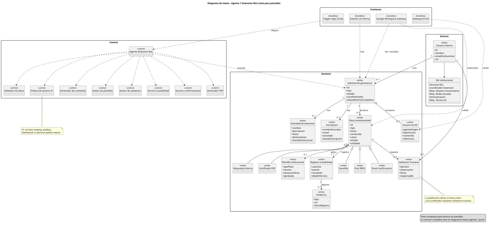

# Diagrama de clases — Agente 1 Extension Bot

**Proyecto:** Proyecto Centenario (P100) — Agente 1, Extension Bot  
**Autor del PPS:** Juan Ignacio Goñe  
**Artefacto:** diagrama de clases para el proyecto de desarrollo del agente  
**Estado:** borrador técnico trazable  
**Última actualización:** 2026-05-18

## 1. Propósito

Este artefacto propone una vista estática inicial del sistema para orientar el desarrollo del Agente 1 — Extension Bot. El modelo transforma los casos de uso vigentes en clases de dominio, clases de control e interfaces externas, manteniendo el alcance institucional definido: el Agente 1 es un agente de comunicación institucional de la Secretaría de Extensión Universitaria, asociado principalmente al Proceso 4 — Comunicación y Difusión Institucional.

El diagrama no define todavía una estructura definitiva de código. Representa un modelo lógico de análisis y diseño que puede refinarse al pasar a implementación en Python/FastAPI, Apps Script y Google Workspace.

## 2. Fuentes consultadas

- `CLAUDE.md`
- `.claude/persistence.md`
- `Agentes/extension_bot_experto.md`
- `Agentes/documentacion_sistemas_experto.md`
- `Agentes/arquitectura_multiagente_experto.md`
- `Contenido/Definicion/arquitectura-multiagente.md`
- `Contenido/bible/README.md`
- `Contenido/bible/Procesos y Agentes.md`
- `Contenido/Campus/DSI1/_md/unidad-iii-i.md`
- `Contenido/Campus/DSI1/_md/unidad-iii-ii.md`
- `Contenido/Campus/DSI1/_md/unidad-v-ii.md`
- `Documentos/CasosUso/Casos-de-Uso-Agente-1-PPS-Juan-Ignacio-Gone.md`

## 3. Criterio de modelado aplicado

Se toma el enfoque de DSI1 para modelado orientado a objetos:

- identificar clases a partir de actores, entidades externas, elementos del dominio, eventos, roles y unidades organizacionales;
- separar clases de entidad, frontera y control;
- asociar responsabilidades con la información que cada clase debe conservar o manipular;
- usar multiplicidades para explicitar relaciones entre objetos;
- mantener una distribución equilibrada de inteligencia en clases de control, dejando las entidades como objetos de dominio simples y auditables.

En consecuencia, el modelo se divide en cuatro paquetes:

1. **Enumeraciones:** tipos, estados, canales y decisiones de validación.
2. **Actores y roles institucionales:** usuarios internos y roles RACI operativos.
3. **Dominio del Agente 1:** solicitudes, actividades, inscripciones, piezas comunicacionales, plantillas, validaciones, trazabilidad y evidencia.
4. **Control e interfaces externas:** servicios que ejecutan casos de uso y fronteras con Google Workspace, Apps Script, lenguaje natural interno y agentes A2-A5.

## 4. Diagrama PlantUML

Fuente editable completa: `Documentos/DiagramaClases/diagrama-clases-agente-1.puml`.

Versiones renderizadas:

- Vista para pantalla: `Documentos/DiagramaClases/diagrama-clases-agente-1-pantalla.svg`
- Vista para pantalla: `Documentos/DiagramaClases/diagrama-clases-agente-1-pantalla.png`
- Vista completa: `Documentos/DiagramaClases/diagrama-clases-agente-1.svg`
- Vista completa: `Documentos/DiagramaClases/diagrama-clases-agente-1.png`

La imagen anterior usa la vista compacta para lectura en pantalla. La fuente canónica con atributos, operaciones y notas de alcance es el archivo `.puml` completo.

```plantuml
@startuml
title Diagrama de clases - Agente 1 Extension Bot

skinparam classAttributeIconSize 0
skinparam packageStyle rectangle
skinparam shadowing false
hide circle

legend right
  <<entity>>  Clase de dominio persistible o auditable
  <<control>> Clase de coordinacion/logica de caso de uso
  <<boundary>> Interfaz con usuario, Google Workspace u otros agentes
endlegend

package "Enumeraciones" {
  enum TipoSolicitud {
    GACETILLA
    POST_RRSS
    CONFIRMACION_INSCRIPCION
    INTERACCION_LN
    CERTIFICADO
  }

  enum EstadoSolicitud {
    RECIBIDA
    INCOMPLETA
    EN_PROCESO
    BORRADOR
    PENDIENTE_VALIDACION
    APROBADA
    OBSERVADA
    RECHAZADA
    FALLIDA
  }

  enum TipoPieza {
    GACETILLA
    POST_RRSS
    EMAIL_CONFIRMACION
    RESPUESTA_INTERNA
    CERTIFICADO_PDF
  }

  enum CanalComunicacion {
    GOOGLE_DOCS
    INSTAGRAM
    LINKEDIN
    GMAIL
    PDF
    CHAT_INTERNO
  }

  enum DecisionValidacion {
    APROBADA
    OBSERVADA
    RECHAZADA
  }
}

package "Actores y roles institucionales" {
  class "Usuario interno" as UsuarioInterno <<entity>> {
    +id: UUID
    +nombre: String
    +emailInstitucional: String
    +rol: RolInstitucional
    +estaHabilitado(): Boolean
  }

  enum RolInstitucional {
    PERSONAL_SEU
    COORDINADOR_EXTENSION
    RESPONSABLE_GESTION_CONOCIMIENTO
    RESPONSABLE_REDES_SOCIALES
    ADMINISTRACION_SECRETARIA
    DOCENTE_RESPONSABLE
    RESPONSABLE_TECNICO_IA
  }
}

package "Dominio del Agente 1" {
  class "Solicitud de generacion" as SolicitudGeneracion <<entity>> {
    +id: UUID
    +tipo: TipoSolicitud
    +estado: EstadoSolicitud
    +canalSolicitado: CanalComunicacion
    +fechaCreacion: DateTime
    +fechaActualizacion: DateTime
    +datosMinimosCompletos: Boolean
    +marcarIncompleta(motivo: String)
    +pasarAValidacion()
    +cerrarConEstado(estado: EstadoSolicitud)
  }

  class "Actividad de extension" as ActividadExtension <<entity>> {
    +id: UUID
    +nombre: String
    +descripcion: Text
    +fecha: Date
    +destinatarios: String
    +responsable: String
    +contacto: String
    +fuenteInstitucional: String
  }

  class "Inscripcion" as Inscripcion <<entity>> {
    +id: UUID
    +nombreInscripto: String
    +email: String
    +fechaHoraActividad: DateTime
    +estadoInscripcion: String
    +esValida(): Boolean
  }

  class "Insumo de agente externo" as InsumoAgenteExterno <<entity>> {
    +id: UUID
    +agenteOrigen: String
    +tipoInsumo: String
    +contenido: Text
    +referencia: URI
    +fechaRecepcion: DateTime
  }

  class "Fuente institucional" as FuenteInstitucional <<entity>> {
    +id: UUID
    +tipo: String
    +origen: String
    +uri: URI
    +descripcion: Text
    +verificada: Boolean
  }

  abstract class "Pieza comunicacional" as PiezaComunicacional <<entity>> {
    +id: UUID
    +tipo: TipoPieza
    +titulo: String
    +contenido: Text
    +canal: CanalComunicacion
    +estado: EstadoSolicitud
    +version: Integer
    +urlSalida: URI
    +requiereValidacionHumana(): Boolean
    +marcarComoBorrador()
  }

  class "Gacetilla institucional" as GacetillaInstitucional <<entity>>
  class "Post para RRSS" as PostRRSS <<entity>>
  class "Email de confirmacion" as EmailConfirmacion <<entity>>
  class "Respuesta interna" as RespuestaInterna <<entity>>
  class "Certificado PDF" as CertificadoPDF <<entity>>

  class "Plantilla institucional" as PlantillaInstitucional <<entity>> {
    +id: UUID
    +tipoPieza: TipoPieza
    +nombre: String
    +version: String
    +ubicacionDrive: URI
    +aprobada: Boolean
  }

  class "Validacion humana" as ValidacionHumana <<entity>> {
    +id: UUID
    +decision: DecisionValidacion
    +observacion: Text
    +fecha: DateTime
    +responsable: String
    +esAprobatoria(): Boolean
  }

  class "Registro de trazabilidad" as RegistroTrazabilidad <<entity>> {
    +id: UUID
    +timestamp: DateTime
    +casoUso: String
    +evento: String
    +resultado: EstadoSolicitud
    +detalleTecnico: Text
    +sinDatosSensibles(): Boolean
  }

  class "Evidencia" as Evidencia <<entity>> {
    +id: UUID
    +tipo: String
    +descripcion: Text
    +uri: URI
    +fechaRegistro: DateTime
  }
}

package "Control de casos de uso" {
  class "Agente Extension Bot" as AgenteExtensionBot <<control>>
  class "Validador de datos" as ValidadorDatos <<control>>
  class "Politica de alcance A1" as PoliticaAlcanceA1 <<control>>
  class "Generador de contenido" as GeneradorContenido <<control>>
  class "Gestor de plantillas" as GestorPlantillas <<control>>
  class "Gestor de validacion" as GestorValidacion <<control>>
  class "Servicio de trazabilidad" as ServicioTrazabilidad <<control>>
  class "Servicio de confirmaciones" as ServicioConfirmaciones <<control>>
  class "Generador de PDF" as GeneradorPDF <<control>>
}

package "Interfaces externas y fronteras" {
  class "Trigger Apps Script" as TriggerAppsScript <<boundary>>
  class "Google Workspace Gateway" as GoogleWorkspaceGateway <<boundary>>
  class "Interfaz lenguaje natural interna" as InterfazLenguajeNatural <<boundary>>
  class "Gateway agentes A2-A5" as GatewayAgentesExternos <<boundary>>
}

UsuarioInterno "1" --> "0..*" SolicitudGeneracion : crea / solicita
UsuarioInterno "1" --> "0..*" ValidacionHumana : realiza
RolInstitucional <-- UsuarioInterno

SolicitudGeneracion "1" --> "0..1" ActividadExtension : usa datos de
SolicitudGeneracion "1" --> "0..1" Inscripcion : usa datos de
SolicitudGeneracion "1" o-- "0..*" FuenteInstitucional : referencia
SolicitudGeneracion "1" o-- "0..*" InsumoAgenteExterno : incorpora
SolicitudGeneracion "1" --> "0..*" PiezaComunicacional : produce
TipoSolicitud <-- SolicitudGeneracion
EstadoSolicitud <-- SolicitudGeneracion

PiezaComunicacional <|-- GacetillaInstitucional
PiezaComunicacional <|-- PostRRSS
PiezaComunicacional <|-- EmailConfirmacion
PiezaComunicacional <|-- RespuestaInterna
PiezaComunicacional <|-- CertificadoPDF
TipoPieza <-- PiezaComunicacional
CanalComunicacion <-- PiezaComunicacional

PiezaComunicacional "0..*" --> "0..1" PlantillaInstitucional : aplica
PiezaComunicacional "1" --> "0..*" ValidacionHumana : controla
PiezaComunicacional "1" --> "1..*" RegistroTrazabilidad : registra
ValidacionHumana "1" --> "1" UsuarioInterno : responsable
DecisionValidacion <-- ValidacionHumana
RegistroTrazabilidad "1" --> "0..*" Evidencia : adjunta

AgenteExtensionBot ..> SolicitudGeneracion : procesa
AgenteExtensionBot ..> ValidadorDatos
AgenteExtensionBot ..> PoliticaAlcanceA1
AgenteExtensionBot ..> GeneradorContenido
AgenteExtensionBot ..> GestorPlantillas
AgenteExtensionBot ..> GestorValidacion
AgenteExtensionBot ..> ServicioTrazabilidad
AgenteExtensionBot ..> ServicioConfirmaciones
AgenteExtensionBot ..> GeneradorPDF

TriggerAppsScript ..> AgenteExtensionBot : dispara
GoogleWorkspaceGateway ..> SolicitudGeneracion : lee / actualiza
GoogleWorkspaceGateway ..> PiezaComunicacional : materializa salida
GoogleWorkspaceGateway ..> RegistroTrazabilidad : persiste evidencia
InterfazLenguajeNatural ..> SolicitudGeneracion : crea
GatewayAgentesExternos ..> InsumoAgenteExterno : recibe
GatewayAgentesExternos ..> SolicitudGeneracion : aporta insumo

@enduml
```

## 5. Lectura del modelo

`SolicitudGeneracion` es el objeto central del flujo. Representa pedidos provenientes de Google Sheets, formularios, Gmail, interacción interna o insumos de agentes A2-A5. Cada solicitud puede vincularse con una `ActividadExtension`, una `Inscripcion`, fuentes institucionales e insumos externos. A partir de ella el sistema produce una o más `PiezaComunicacional`.

`PiezaComunicacional` agrupa los productos que el Agente 1 puede generar: gacetilla, post para redes, email de confirmación, respuesta interna y certificado PDF. Esta generalización evita duplicar reglas comunes de estado, versión, canal, plantilla, validación y trazabilidad.

`ValidacionHumana` y `RegistroTrazabilidad` son clases de dominio de primer orden, no detalles secundarios. El proyecto exige validación humana en contenidos institucionales críticos y evidencia auditable para reconstruir qué se generó, desde qué fuente, con qué estado y bajo responsabilidad de quién.

Las clases de control concentran la lógica: validación de datos mínimos, política de alcance, generación de contenido, plantillas, validación, trazabilidad, confirmaciones y certificados. Las clases de frontera encapsulan Google Workspace, Apps Script, lenguaje natural interno y recepción de insumos A2-A5.

## 6. Trazabilidad mínima

| Clase / grupo | Casos de uso vinculados | Proceso BPM | DoD / control asociado | Evidencia |
|---|---|---|---|---|
| `SolicitudGeneracion` | CU-A1-01 a CU-A1-05 | P4, P5 soporte | Datos mínimos, estado de ejecución | Fila Sheets, registro de solicitud |
| `ActividadExtension` | CU-A1-01, CU-A1-02 | P3, P4 | Datos fuente verificables | Planilla, fuente institucional |
| `Inscripcion` | CU-A1-03, CU-A1-05 | P5, P4 soporte | Inscripción válida | Fila Sheets, registro administrativo |
| `PiezaComunicacional` y subclases | CU-A1-01 a CU-A1-05 | P4, P5 soporte | Borrador generado, canal correcto, plantilla | Docs, post, email, PDF |
| `PlantillaInstitucional` | CU-A1-01, CU-A1-03, CU-A1-05 | P4, P5 | Plantilla definida y aprobada | Archivo Drive / Docs |
| `ValidacionHumana` | CU-A1-06 | P4, P5 | Aprobación, observación o rechazo | Checklist, estado, usuario validador |
| `RegistroTrazabilidad` y `Evidencia` | CU-A1-07 | Transversal CONEAU | Log sin credenciales ni datos sensibles innecesarios | Log estructurado, vínculos a salidas |
| `PoliticaAlcanceA1` | Todos | P4 | Bloqueo de scraping, analítica, publicación automática y atención pública masiva | Estado rechazado/observado |
| `GoogleWorkspaceGateway` | Todos | Plataforma base | Integración Sheets, Docs, Drive, Gmail | Documentos, emails, planillas, registros |
| `GatewayAgentesExternos` | CU-A1-01, CU-A1-02 | P4 con insumos A2-A5 | Recepción de insumos sin orquestación | Registro de origen del insumo |

## 7. Supuestos y pendientes

- Los campos definitivos de Google Sheets, plantillas institucionales y checklists quedan pendientes de confirmación con la Secretaría.
- El modelo asume que Google Sheets funciona como bus de datos operativo, según la arquitectura P100 vigente.
- Las confirmaciones de inscripción pueden automatizarse solo si usan una plantilla previamente aprobada y datos válidos; los contenidos públicos, críticos o certificados requieren validación humana antes de publicación, envío oficial o emisión.
- Los destinatarios externos no son usuarios directos del Agente 1 en el alcance vigente.
- El diagrama excluye scraping, analítica, KPIs, dashboards y atención masiva al público general porque corresponden a otros agentes o quedan fuera del alcance del Agente 1.
