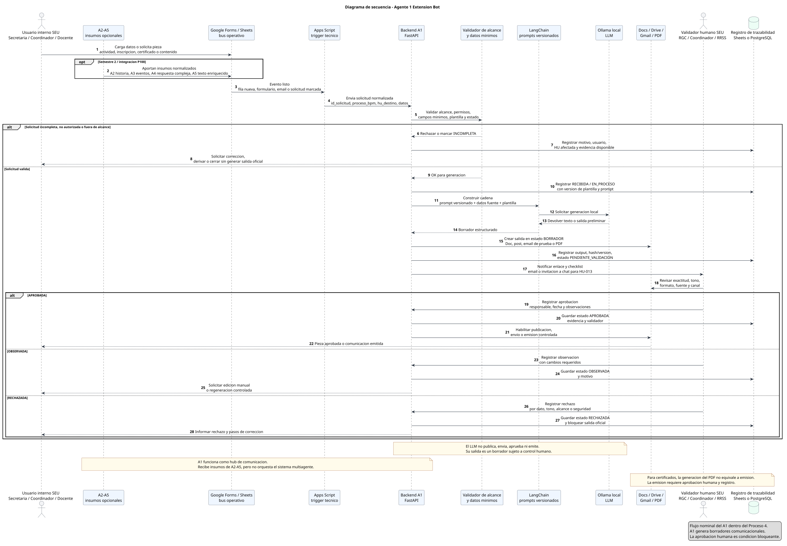

# Diagrama de secuencia - Agente 1 Extension Bot

**Proyecto:** Proyecto Centenario (P100) - Agente 1, Extension Bot  
**Autor del PPS:** Juan Ignacio Gone  
**Artefacto:** evaluacion sintetica y diagrama de secuencia  
**Estado:** borrador academico trazable  
**Ultima actualizacion:** 2026-05-18

## 1. Proposito

Este artefacto evalua el proyecto de desarrollo del Agente 1 desde el flujo de interaccion esperado entre usuarios, Google Workspace, backend del agente, motor LLM, validacion humana y registro de evidencia. Su objetivo es consolidar en un diagrama de secuencia el comportamiento operacional defendible del Agente 1 sin ampliar su alcance ni convertirlo en orquestador del sistema multiagente.

El diagrama esta pensado como complemento de los casos de uso, diagrama de clases, plan de integracion, plan de calidad, plan de despliegue y anteproyecto vigente.

## 2. Fuentes consultadas

- `CLAUDE.md` y `AGENTS.md`
- `.claude/persistence.md`
- `Agentes/extension_bot_experto.md`
- `Agentes/arquitectura_multiagente_experto.md`
- `Agentes/documentacion_sistemas_experto.md`
- `Agentes/evaluador_cicerchia.md`
- `Contenido/Definicion/arquitectura-multiagente.md`
- `Contenido/bible/README.md`
- `Contenido/bible/Procesos y Agentes.md`
- `Documentos/Anteproyecto/Anteproyecto-PPS-Juan-Ignacio-Gone.tex`
- `Documentos/CasosUso/Casos-de-Uso-Agente-1-PPS-Juan-Ignacio-Gone.md`
- `Documentos/PlanIntegracion/Plan-Integracion-Agente-1-PPS-Juan-Ignacio-Gone.md`
- `Documentos/PlanCalidad/Plan-Calidad-Agente-1-PPS-Juan-Ignacio-Gone.md`
- `Documentos/PlanDespliegue/Plan-Despliegue-Agente-1-PPS-Juan-Ignacio-Gone.md`
- `Documentos/PlanRiesgos/Plan-Riesgos-Agente-1-PPS-Juan-Ignacio-Gone.md`

Tambien se incorporaron dos lecturas read-only de subagentes: una sobre alcance/arquitectura del Agente 1 y otra sobre madurez, riesgos y flujo operativo derivado del anteproyecto y planes de gestion.

## 3. Evaluacion sintetica

**Veredicto:** APROBADO CON OBSERVACIONES FUERTES.

El proyecto es consistente y defendible como diseno documental del Agente 1. El alcance esta correctamente acotado al Proceso 4 - Comunicacion y Difusion Institucional, con apoyo limitado a P3, P5 y P6 cuando la salida sea una pieza comunicacional o documental propia del A1. Las historias HU-010 a HU-014 tienen DoD, evidencias esperadas y responsables por rol; el stack tecnico propuesto es coherente con el criterio de bajo costo y soberania de datos: Google Workspace, Apps Script, FastAPI, LangChain, Ollama local, logs en Sheets o PostgreSQL y colas asincronicas en S2.

La observacion principal es que el proyecto esta en una madurez documental fuerte, no en TRL operativo demostrado. Para sostener TRL 3 o TRL 4 faltan evidencias ejecutadas: outputs generados, logs recuperables, checklist SEU, validadores confirmados, plantillas versionadas, pruebas de seguridad, benchmark de latencia y actas o informes de gate.

## 4. Diagrama

Version editable PlantUML: `diagrama-secuencia-agente-1.puml`  
Version renderizada recomendada: `diagrama-secuencia-agente-1.svg`

## 5. Lectura del flujo nominal

1. Un usuario interno de la SEU carga datos o solicita una pieza mediante Google Forms, Sheets, Gmail o una interfaz equivalente de Google Workspace.
2. En S2 o integracion P100, A2-A5 pueden aportar insumos normalizados: contenido historico, datos de eventos, respuestas complejas o texto enriquecido. A1 consume estos insumos, pero no coordina el sistema.
3. Google Sheets funciona como bus operativo. Apps Script detecta el evento y activa el backend del Agente 1.
4. FastAPI recibe la solicitud, valida alcance, permisos, campos minimos, estado, historia de usuario y plantilla disponible.
5. Si la solicitud no es procesable, se registra el motivo y se pide correccion o derivacion. No se genera salida oficial.
6. Si la solicitud es valida, LangChain arma la cadena de prompt con datos fuente y plantilla; Ollama ejecuta la inferencia local.
7. El backend crea una salida en borrador: Google Doc, post, email de prueba o PDF.
8. El sistema registra version de prompt/plantilla, estado, output y evidencia.
9. Un validador humano revisa exactitud, tono, formato, fuente y adecuacion al canal.
10. Solo si la validacion queda en estado `APROBADA`, el sistema habilita publicacion, envio o emision controlada.

## 6. Flujos alternativos criticos

| Caso | Respuesta esperada | Evidencia minima |
|---|---|---|
| Datos incompletos | Marcar `INCOMPLETA`, solicitar correccion y no generar salida oficial | Log con motivo, usuario, HU y fecha |
| Solicitud fuera de alcance | Rechazar o derivar; no absorber funciones de A4/A5 ni soporte administrativo general | Registro de rechazo y proceso BPM asociado |
| Plantilla no aprobada | Permitir solo prueba controlada o bloquear uso oficial | Estado de plantilla y decision registrada |
| Texto dudoso o posible alucinacion | Observar o rechazar; requerir edicion manual o regeneracion | Checklist, observacion y version de prompt |
| HU-012 con texto LLM | Mantener como borrador; envio automatico solo con plantilla deterministica preaprobada | Email de prueba, log y regla aplicada |
| HU-013 lenguaje natural | Mantener uso interno mediante email con invitacion a chat y registro en Sheets | Captura/transcript y registro operativo |
| HU-014 certificados | Generar PDF no equivale a emitir; emision bloqueada hasta aprobacion humana | PDF, aprobacion manual, log y responsable |
| Falla tecnica | Registrar `FALLIDA`, conservar solicitud y habilitar reintento o fallback manual | Error tecnico, timestamp, id_solicitud |

## 7. Trazabilidad minima

| Elemento del diagrama | Proceso BPM / HU | DoD o criterio | Evidencia | Responsable por rol |
|---|---|---|---|---|
| Carga de datos en Workspace | P4 / HU-010, HU-011; P5/P4 para HU-012 y HU-014 | Datos fuente completos y verificables | Fila Sheet, formulario, documento o mail | Personal SEU / coordinador o docente responsable |
| Trigger Apps Script | HU-010 a HU-014 | Solicitud detectada sin duplicar ni perder estado | Evento, timestamp, id_solicitud | Responsable tecnico IA |
| Validacion de alcance y datos | Transversal | No procesar solicitudes fuera de alcance ni incompletas | Log de validacion o rechazo | Responsable tecnico IA |
| Generacion con LangChain + Ollama | HU-010 a HU-014 | Borrador coherente, sin informacion inventada y adaptado al canal | Output, prompt/version, tiempo de generacion | Juan Ignacio Gone / responsable tecnico IA |
| Salida en Docs, Gmail o PDF | HU-010 a HU-014 | Salida queda como borrador o pendiente de validacion | Link a Doc, borrador, email de prueba o PDF | Responsable tecnico IA |
| Validacion humana | CU-A1-06 / todas las HU con salida oficial | Aprobacion, observacion o rechazo antes de publicar/enviar/emitir | Checklist, estado, validador, fecha | RGC, Coordinador, RRSS, Administracion segun pieza |
| Registro de trazabilidad | CU-A1-07 / transversal | Flujo reconstruible para auditoria CONEAU y gate TRL | Logs, evidencia_uri, estado, hashes si aplican | Responsable tecnico IA / Director para gate |

## 8. Pendientes de confirmacion

- Campos definitivos de las planillas Google Sheets.
- Plantillas institucionales finales para gacetillas, posts, emails y certificados.
- Validadores nominales y suplentes por canal.
- Protocolo formal de checklist SEU y acta de gate.
- Entorno real disponible para ejecutar Ollama/FastAPI y medir latencia.
- Politica institucional para cuentas de servicio, permisos, secretos y logs.
- Contratos de insumo A2-A5 antes de integracion real.

## 9. Recomendacion

Usar este diagrama como base para validar el flujo con la SEU antes de implementar automatizaciones reales. La decision clave a controlar es que la aprobacion humana sea una condicion tecnica del sistema, no solo una regla escrita: ninguna ruta debe publicar, enviar oficialmente o emitir certificados sin estado `APROBADA` y evidencia asociada.
